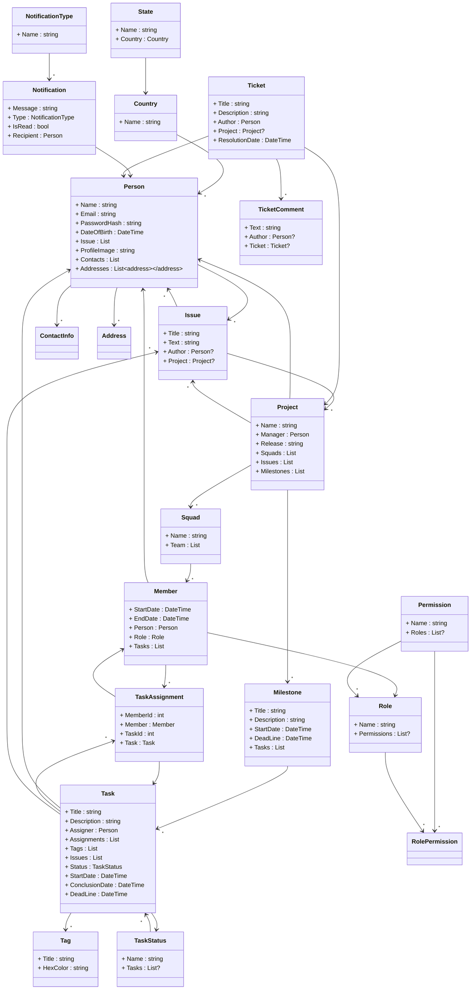

# Projects Management

## Proposta

Um projeto para estudo do .net 6, tem como ideia ser um projeto que permita a gerencia de projetos, times, tasks e resposaveis por tasks, algo semelhante.

### Roadmap

| -   | Categoria   | Titulo                          | Descricao                                                                                | Concluida |
| --- | ----------- | ------------------------------- | ---------------------------------------------------------------------------------------- | --------- |
| 1   | Docs        | Modelar casos de uso do projeto | Realizar modelagem dos casos de uso do projeto                                           | N         |
| 2   | Docs        | Modelar classes do projeto      | Realizar modelagem do sistema                                                            | N         |
| 3   | Docs        | Modelar banco do projeto        | Realizar modelagem do banco de dados do projeto                                          | N         |
| 4   | Data Access | Mapear classes para o Entity    | Realizar mapeamento de classes para o Entity trabalhar corretamente com o banco de dados | N         |
| 5   | Auth        | Adicionar autenticacao          | Adicionar autenticacao ao projeto                                                        | N         |
| 6   | Auth        | Adicionar autorizacao           | Adicionar autorizacao ao projeto seguindo o diagrama de casos de uso                     | N         |

### Documentacao

#### Diagrama de Classe

